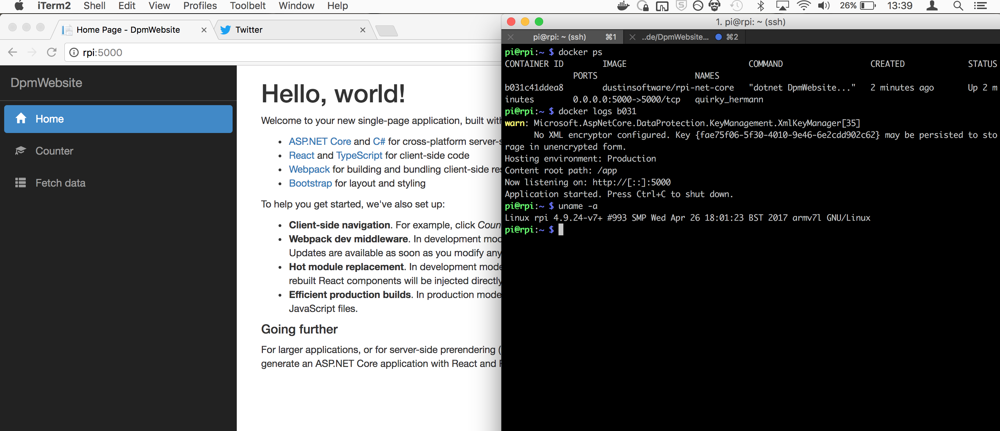

# Raspberry Pi 3 + Docker + ASP.NET Core


## To try it out
```
docker pull dustinsoftware/rpi-net-core
docker run -d -p 5000:5000 dustinsoftware/rpi-net-core
```

## Nobody wants to run this in production, why bother?
For fun of course! The Raspberry Pi is an amazing embedded platform to hack on projects with.

`dotnet new react` by default will give you a project that runs fine on x86/x64 architectures. The RPI, however, runs on arm32v7. We'll need to make a few small changes to support this architecture.

## ARM is supported by .NET Core, so why doesn't ASP.NET core just work?
New projects by default include the metapackage [Microsoft.AspNetCore.All](https://docs.microsoft.com/en-us/aspnet/core/fundamentals/metapackage), which makes some assumptions about what libraries are already on the runtime target. For this to work with Docker, this means the runtime image needs to be [microsoft/aspnetcore](https://hub.docker.com/r/microsoft/aspnetcore/) However, this poses a problem!

There is no ARM package for the microsoft/aspnetcore Docker image. The [dockerfile](https://github.com/aspnet/aspnet-docker/blob/3fb758ced1e1735d604b30dfc2ff554d2b7a2f5d/2.0/jessie/runtime/Dockerfile#L5) indicates that pre-made binaries for this image are pulled from a CDN, but there don't appear to be any that exist for armv7.

## Using a different base image

Fortunately, there is a docker image already for the [ARMv7 .NET Core runtime](https://github.com/dotnet/dotnet-docker/blob/master/2.0/runtime/stretch/arm32v7/Dockerfile), we are be able to use that as a base image! Now we just have to declare the AspNetCore dependencies explicitly.

For this project, I just needed to reference:
```
Microsoft.AspNetCore
Microsoft.AspNetCore.Mvc
Microsoft.AspNetCore.SpaServices
Microsoft.AspNetCore.StaticFiles
```

### Building the project

[The documentation](https://github.com/dotnet/core/blob/821308121660d19accb1043ce637a64a42494364/samples/RaspberryPiInstructions.md) shows how to go about building - you must use a machine with the full SDK to build, then push the built binaries to the Raspberry PI. I won't bother copying it here :) Make sure to use the aspnetcore-sdk base image so you have Node available during the build as well.

Get a local build working first:
```
docker build -t netcore-local .
docker run -d -p 5000:5000 netcore-local
```

Once this is confirmed working, build an ARM specific image:
```
docker build -t dustinsoftware/rpi-net-core -f Dockerfile.arm32 .
docker push dustinsoftware/rpi-net-core
```

If you are having trouble, get the ID of the image, then use `docker logs (containerid)`


### Thanks for reading!

This was a fun exercise. It's so exciting to see the .NET platform become more accessible, hats off to the whole team for making this a reality!
